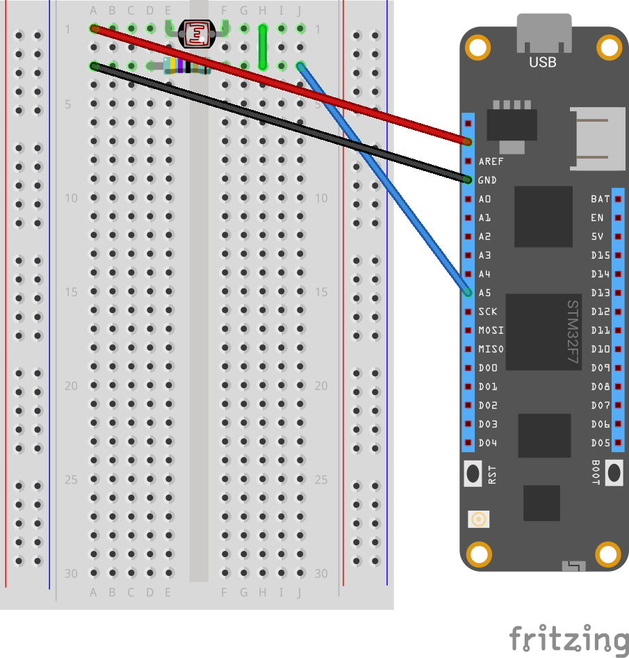

# meadow_photoresistor

* [9/11/2022 5:40:48 PM] Meadow StdOut: Initializing file system...
* [9/11/2022 5:40:49 PM] Meadow StdOut: File system initialized.
* [9/11/2022 5:40:49 PM] Meadow StdOut: Initializing hardware...
* [9/11/2022 5:40:51 PM] Meadow StdOut: Hardware initialized.
* [9/11/2022 5:40:53 PM] Meadow StdOut: Analog observer triggered; new: 2.96V, old: V
* [9/11/2022 5:41:02 PM] Meadow StdOut: Analog observer triggered; new: 2.45V, old: 2.96V
* [9/11/2022 5:41:03 PM] Meadow StdOut: Analog observer triggered; new: 2.96V, old: 2.45V
